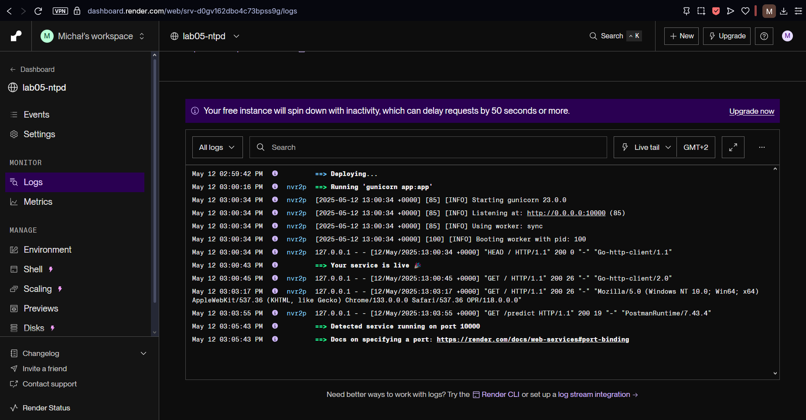
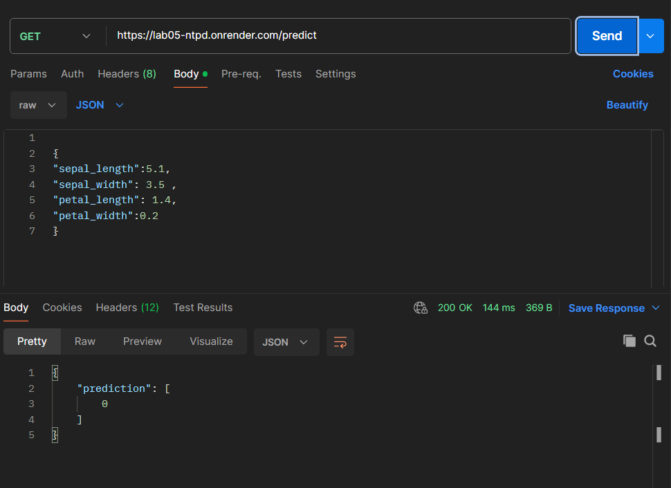
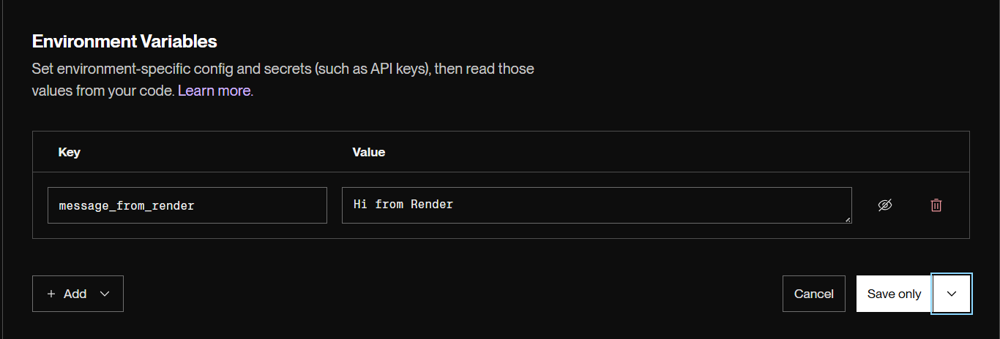
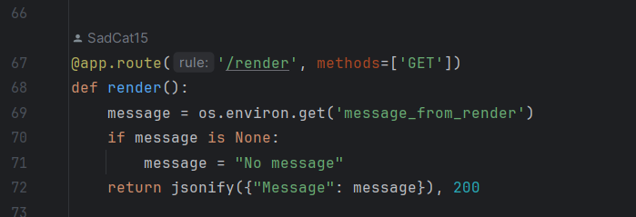
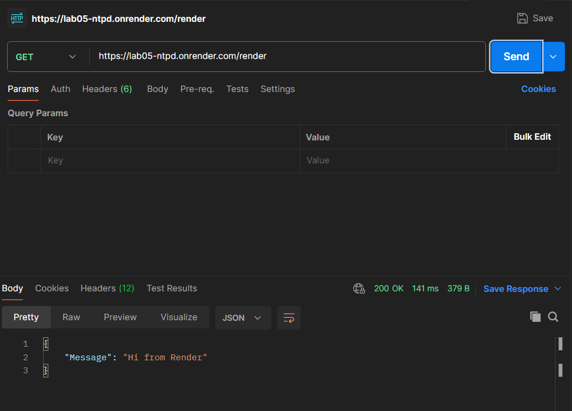

# Nowoczesne technologie przetwarzania danych

## Michał Grzona, grupa 3

### Wdrożenie aplikacji w Render

Udało się wdrożyć aplikację na serwis Render

'

### Porównanie zalet i wad wdrożeń serverless vs własny serwer

Podczas porównania wdrożeń serverless vs własny serwer należy zwrócić uwagę na:

1. Możliwość skalowania - w przypadku serverless przy wykupie odpowieniego planu skalowanie w górę i w dół wykonuje się
   automatycznie, w sytuacji, gdy program chodzi na naszej maszynie musimy ręcznie dbać o odpowiednie skalowanie.
2. Cena - istnieje możliwość wybrania mocno ogranicznego, jednak darmowego planu w przypadku sytuacji serverless, za
   postawienie własnego środowiska uruchomieniowego zawsze będziemy płacić.
3. Przygotowanie aplikacji do uruchomienia na własnym serwerze jest bliźniaczo podobne do przygotowanie pod serverless.
4. Posiadając apliację na własnym serwerze mamy większe możliwości konfiguracji niż w usłudze serverless.

### Konfiguracja środowiska i obsługa zmiengnych konfiguracyjnych w Google Cloud Run / Render

Dodanie zmiennej środowiskowej przez Render 

Dodałem endpoint wykorzystujący zmienną środowiskową

Działanie:
