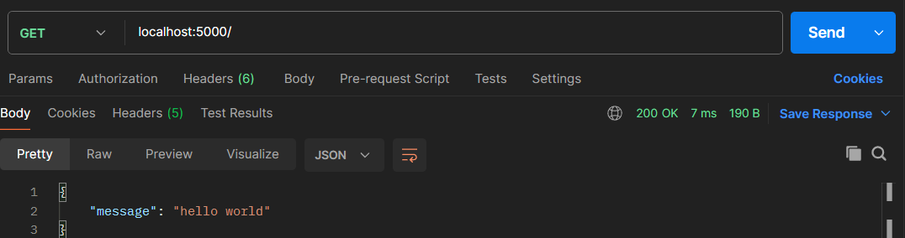
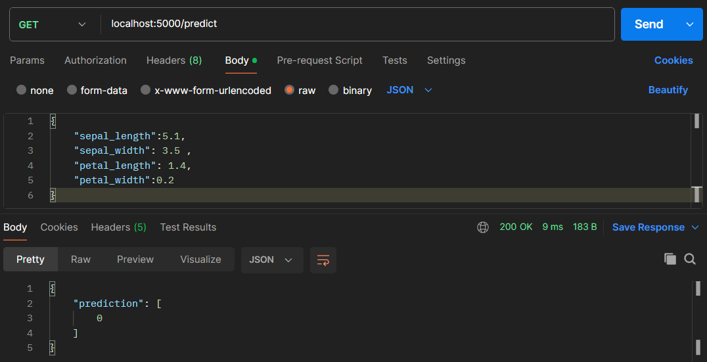
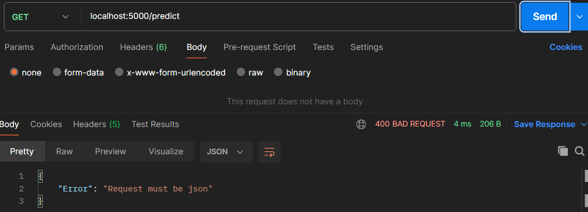
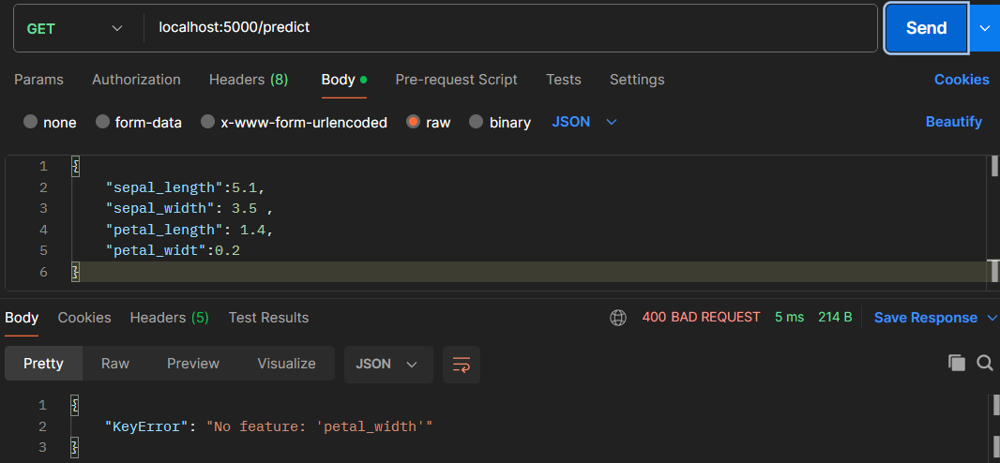
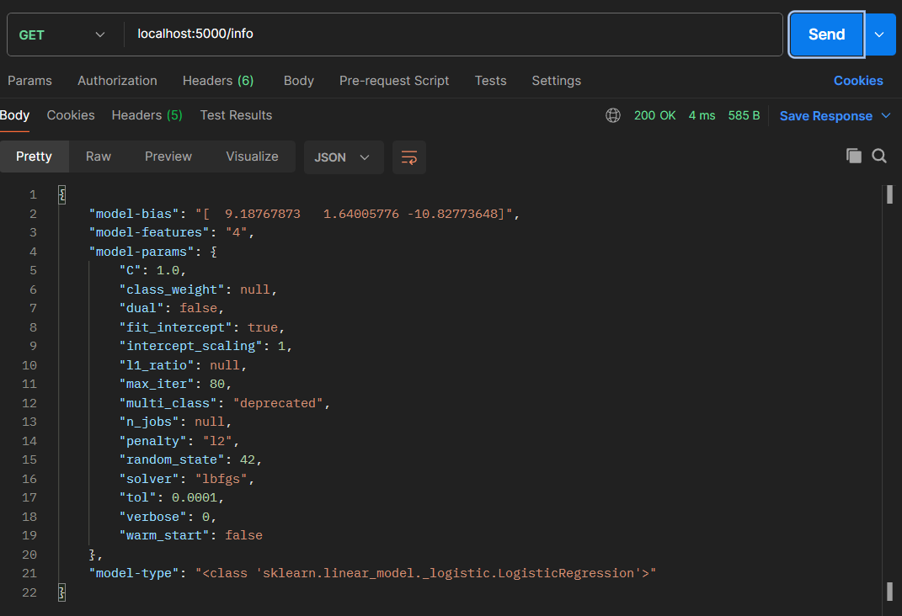
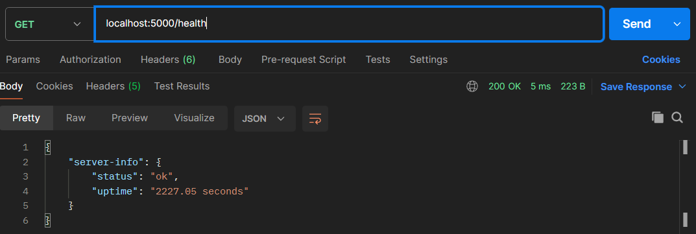
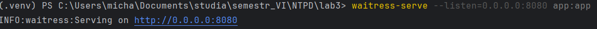
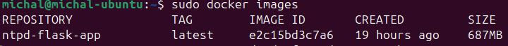
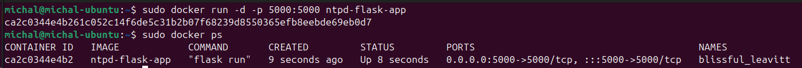
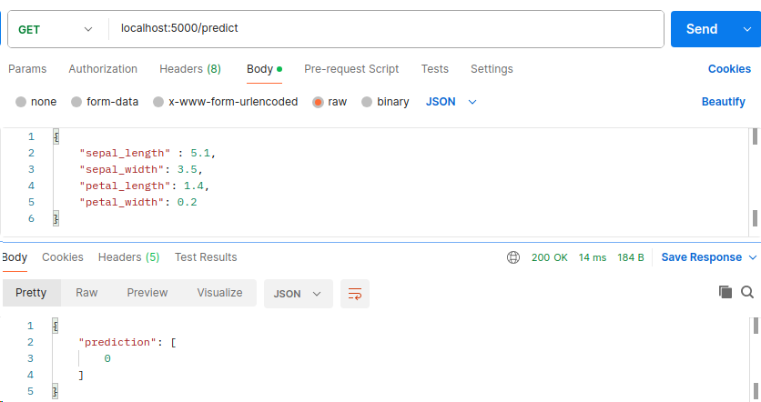

# Michał Grzona, grupa 3, 121356
## Nowoczesne technologie przetwarzania danych

# Laboratorium 3.

### Zawartość plików
- <i>model.pkl</i> - plik zawierający zapisany model.
- <i>model.py</i> - skrypt wczytujący model z pliku. W przypadku, gdy nie ma zapisanego modelu tworzy nowy model regresji logistycznej. Model został wytrenowany na datasecie <i>Iris</i> pochodzącym z biblioteki <i>sci-kit learn</i>
- <i>app.py</i> - główny skrtyp aplikacji, obsluga endpointów API.

### Endpointy API
- <i>/</i> - zwraca prostą wiadomość w formacie json (zadanie 1.)

- <i>/predict</i> - zwraca predykcję modelu regresji logistycznej (zdanie 2). W celu uzyskania odpowiedzi na żądanie należy przesłać odpiwdnie dane w formacie json. Model zwraca odpwiedź w formacie json. W odpowiedzi znajduje się predykcja modelu reprezentowana przez numer klasy. Przykład zapytania:

W przypadku błędnego zapytania (nieprawidłowy format) wyświetli się odpowiedni komunikat (zadanie 3.):
  - W przypadku przesłania danych w formacie innym niż json:
  
  - W przypadku braku odpowiednich kluczy:
  
- <i>/info</i> - zwraca informacje o modelu (zadanie 4.)

- <i>/health</i> - zwraca informacje dotyczące statusu serwera (zadanie 4.)

### Zdanie 5. Uruchomienie środowiska produkcyjnego
Ze względu, iż Gunicorn nie działa na systemie Windows wykorzystałem Waitress.

Aplikacja działa na porcie 8080.

# Laboratorium 4.

### Zadanie 1.
Utworzyłem plik <i>requirements.txt</i> zawierający moduły konieczne do instalacji do wirtualnego środowiska w celu poprawnego działania aplikacji. Wymagane biblioteki to:
- NumPy
- Flask
- scikit-learn

### Zadanie 2. Ze względu na wygodę korzystania z Dockera resztę ćwiczenia wykonałem na maszynie wirtualnej z systemem operacyjnym Ubuntu
Utworzyłem dockerfile o nazwie Dockerfile w drzewie projektu. Następnie na jego podstawie utworzyłem obraz dockerowy.

### Zadanie 3. 
Na podstawie wcześniej utworzonego obrazu utworzyłem kontener docker za pomocą komendy `docker run -d -p 5000:5000 ntpd-flask-app`.

Aplikacja po ruchumieniu w kontenerze działa poprawnie. Przykładowa predykcja:
